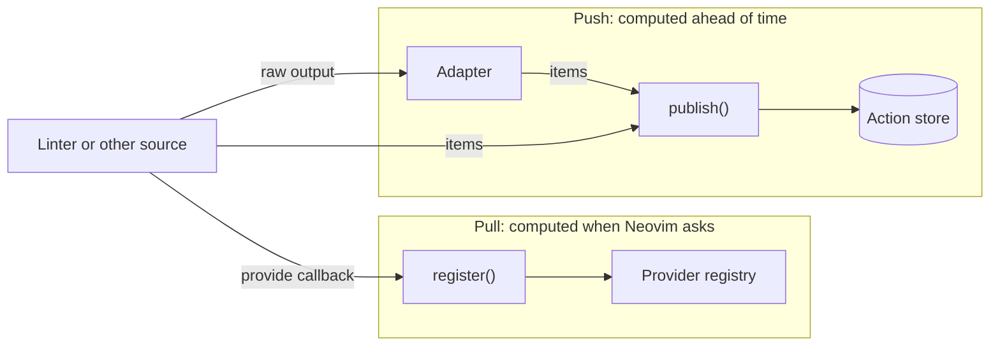
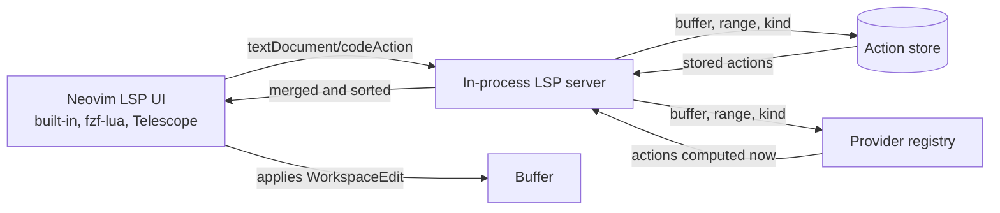

# Architecture

Neovim's code-action UI queries LSP clients, while linters and other action
sources run outside that interface. `lint-actions.nvim` runs an in-process LSP
server that exposes their structured actions to the built-in UI, fzf-lua,
Telescope, and other LSP-aware pickers.

## Scope

The server deliberately implements one LSP capability:
`textDocument/codeAction`. The plugin neither runs external tools nor advertises
diagnostics, formatting, or unrelated LSP capabilities, and it draws no UI.
Action sources and adapters produce structured actions, lint-actions serves
them through LSP, the selected UI handles selection and any preview, and Neovim
applies the action and manages undo.

## Getting actions in

The plugin accepts actions through push and pull APIs. The choice depends on
when the source computes them.

### Push: `publish()`

Use `publish()` for actions computed before a code-action request, such as the
result of an external tool run. Published actions remain in the action store
until their source replaces or clears them.

`publish()` accepts prebuilt actions. An *adapter* can instead parse a
specific tool's output, such as golangci-lint, markdownlint, shellcheck JSON, or
the reusable SARIF format, and return actions.

The [nvim-lint](https://github.com/mfussenegger/nvim-lint) integration passes
output already collected by nvim-lint to an adapter, avoiding a second linter
run.

#### nvim-lint parser wrapping

nvim-lint runs the linter process and publishes the diagnostics. Each linter
definition has a `parser` function that reads the tool's output.

The integration wraps nvim-lint's `lint()` entry point once. For attached
parsers, it captures the buffer's `changedtick` before the run and passes a
shallow copy of the linter with a parser bound to that run. Other linters pass
through unchanged. Each process keeps its own snapshot, including when a
definition is shared by overlapping runs or several buffers.

The integration wraps it. When nvim-lint calls the parser, the integration:

1. calls the original parser to get the diagnostics,
2. hands both the diagnostics and the same raw output to the adapter if the
   buffer has not changed and the run has not been cancelled,
3. returns the diagnostics to nvim-lint untouched.

Sometimes an adapter needs richer output than the linter produces by default,
such as JSON instead of plain text. Adding a `--json` argument alone would
break diagnostics because the old parser cannot read the new format. The
argument and parser must change together.

The `configure` hook updates the linter definition before parser wrapping.
Table-based linters can also be modified directly. For a factory, which returns
a new definition on every run, the integration applies `configure` to each
generated definition before wrapping its parser.

### Pull: `register()`

Background tools can publish actions when a run finishes. An action derived
directly from the current buffer would otherwise need autocmds, debouncing, and
invalidation to keep a published batch current.

A registered provider computes those actions on demand. When Neovim requests
code actions, the plugin calls `provide` with the current buffer state and uses
the returned items.

`provide` runs while Neovim waits for the response, so it must be synchronous
and quick. If it raises an error, the plugin reports it and skips that provider;
the rest of the request is unaffected.

Both routes return the same item shape and use the same range and action-kind
matching.

## What an action can contain

For an action that edits the current buffer, put a `TextEdit` (or a list of
them) in its `edit` field. `publish()` wraps that in the `WorkspaceEdit`
required by the LSP `CodeAction` type and stamps it with the buffer's document
version.

For changes across several files, or file operations like renames, supply a
full `WorkspaceEdit` yourself.

## How actions are stored

Actions are stored per buffer, per source. Publishing again for a source
replaces only that source's actions, so several sources can write to the same
buffer without stepping on each other.

`source` is a replacement key, not a display label. The LSP `CodeAction` type
has no producer field, and Neovim labels menu entries with the client name.

## Getting actions out

The LSP server starts when a source first publishes an action or an applicable
provider is registered. One server is shared, and it attaches only to buffers
that can receive actions.

When a `textDocument/codeAction` request arrives, the server asks the store
and every registered provider for actions matching the buffer, the requested
range, and the action-kind filter if the client sent one. Ranges are matched
by line; an item with no range applies to the whole buffer.

The reply is a list of plain `CodeAction` objects. Neovim or a third-party
picker then handles selection, preview, and application through its normal LSP
path.

## Avoiding stale actions

A published action is valid only for the buffer version from which it was
computed.

The nvim-lint bridge rejects results if the buffer's `changedtick` differs
from the snapshot captured before the run, even if the buffer was saved again
while the linter was running. Cancelled runs are also ignored. Neither kind
of rejected result clears actions that a newer run may have published.

Before returning stored actions, the plugin compares the batch's recorded URI,
`changedtick`, and LSP document version with the current buffer. A mismatch
discards the batch, including when a buffer was renamed without changing its
text. A source must publish again to target the new URI.

Edits for the current buffer are also sent as versioned
`documentChanges`. If the buffer changes between opening the menu and selecting
an action, Neovim rejects the edit instead of applying stale offsets.
