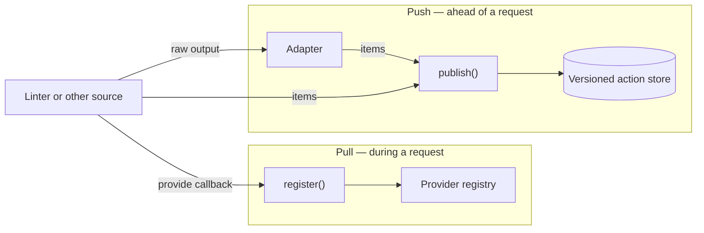
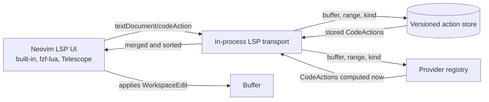

# Architecture

`lint-actions.nvim` connects fix sources to Neovim's existing LSP code-action UI.
It makes structured fixes available to tools that already understand LSP code actions.
It does not run linters or provide a picker for code actions.

## Supplying actions

A source reaches the code-action UI one of two ways, and the difference is
when its actions are computed.

## Publishing

A source can call `publish()` directly with normalized actions.
Tool-specific adapters handle formats such as golangci-lint and markdownlint
JSON, while integrations capture output another plugin already produced.
The [nvim-lint](https://github.com/mfussenegger/nvim-lint) integration wraps its parser and never launches a second process.

### Parser interposition

nvim-lint owns process execution and diagnostic publication, while each
linter definition owns output interpretation through its `parser` function.
The integration calls that parser first, passes both its diagnostics and the
same raw output to the selected adapter, then returns the diagnostics to
nvim-lint unchanged.

This also supports richer output formats than a bundled linter definition
uses by default. The source must switch the command arguments and parser as
one operation: for example, a `--json` argument must be paired with a JSON
parser returning `vim.Diagnostic[]`. The adapter can then consume the JSON for
fix metadata without disrupting nvim-lint's normal diagnostic flow.

That switch is a `configure` hook rather than something each integration does
for itself, because nvim-lint resolves a linter either as a table or as a
factory rebuilt on every run. The bridge owns that resolution once and calls
`configure` on whichever definition it produces, immediately before wrapping
the parser.

For same-buffer fixes, a source may put one `TextEdit` or a list of text edits in an action's `edit` field.
Publication wraps that shorthand in a versioned `WorkspaceEdit`, which is the type required by the LSP `CodeAction` protocol.
A source can instead supply a full `WorkspaceEdit` for multi-document changes or resource operations.

Actions are stored by buffer and source.
Republishing replaces only that source, so several sources can coexist without coordinating with each other.
`source` is that replacement key and nothing more: the LSP `CodeAction` type has no provenance field,
and Neovim labels picker entries with the client name rather than anything a source chooses.

## Providing

Publication is a push: the source decides when its actions change and has to
watch the buffer to know. That fits tools whose output arrives asynchronously,
and it is the wrong shape for actions that are simply a function of buffer
content.

A registered provider is pulled instead. The transport asks it for actions
inside the `textDocument/codeAction` request, so it computes against the
current buffer and needs no autocmds, debouncing, or staleness handling. The
cost is that `provide` runs on the request path and must be synchronous; a
provider that raises is reported and skipped without failing the request.

Both paths produce the same items and are matched by the same rule.

## Serving actions

The first non-empty publication, or a provider that applies to a buffer,
starts a small in-process LSP client.
The same client is reused and attached only to buffers that publish actions or that a provider serves.
When Neovim requests `textDocument/codeAction`, the transport asks the store and the registered providers
for actions matching the buffer, requested range, and optional action-kind filter.
Ranges are matched by line; an item without a range covers the whole buffer.

The response contains ordinary `CodeAction` objects.
Neovim and third-party pickers therefore handle selection, preview, and application through their normal LSP paths.

## Stale-edit protection

Each publication records both the buffer changed tick and its current LSP document version.
A batch is discarded when either value no longer matches.

Edits for the current buffer are returned as versioned `documentChanges`.
This second check matters when the buffer changes after the action picker opens: Neovim rejects the selected edit instead of applying old offsets to new content.
