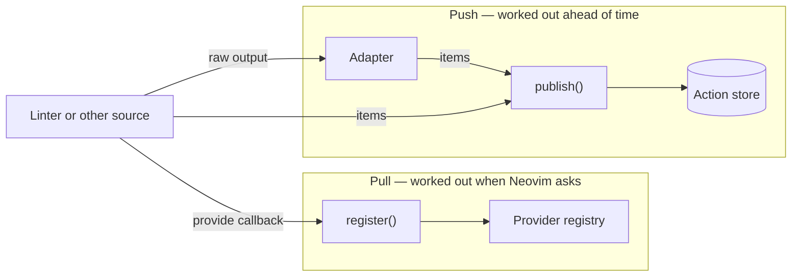
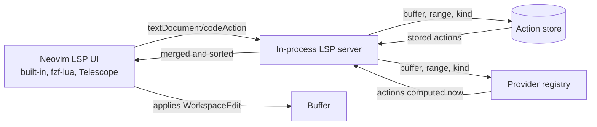

# Architecture

Some linters do more than report a problem — they also tell you how to fix it.
Neovim already has a good UI for applying fixes: the LSP code-action menu.
But that menu only talks to LSP servers, and a linter is not an LSP server.

`lint-actions.nvim` fills that gap. It runs a small LSP server inside Neovim
that serves nothing but code actions. Fixes from linters go in, and they come
out the other side as ordinary code actions, so `vim.lsp.buf.code_action()`,
fzf-lua, Telescope, and anything else that speaks LSP can show and apply them.

The plugin does not run linters and does not draw any UI of its own.

## Getting fixes in

There are two ways to hand fixes to the plugin. They differ in *when* the
fixes are worked out.

### Push: `publish()`

Use this when the fixes come from a tool that takes time to run. The tool
finishes, you call `publish()`, and the fixes sit in the store until Neovim
asks for them.

You can call `publish()` yourself with ready-made actions. Or you can let an
*adapter* do the conversion: adapters know how to read a specific tool's
output, such as golangci-lint, markdownlint, shellcheck JSON, or the reusable
SARIF format, and turn it into actions.

The [nvim-lint](https://github.com/mfussenegger/nvim-lint) integration is the
usual way to feed an adapter. It reuses output nvim-lint already collected, so
your linter never runs twice.

#### How the nvim-lint integration hooks in

nvim-lint runs the linter process and publishes the diagnostics. Each linter
definition has a `parser` function that reads the tool's output. That parser
is the hook point.

The integration wraps it. When nvim-lint calls the parser, the integration:

1. calls the original parser to get the diagnostics,
2. hands both the diagnostics and the same raw output to the adapter,
3. returns the diagnostics to nvim-lint untouched.

nvim-lint never notices, and the adapter gets everything it needs.

Sometimes an adapter needs richer output than the linter produces by default
— JSON instead of plain text, for instance. Adding a `--json` argument alone
would break diagnostics, because the old parser cannot read the new format.
The argument and the parser have to change together.

That is what the `configure` hook is for. You could set both by hand, but
nvim-lint lets a linter be either a plain table or a factory that is rebuilt
on every run — and a factory throws your changes away each time. The
integration resolves the linter once, calls `configure` on whatever it gets,
and only then wraps the parser.

### Pull: `register()`

Push means the source decides when its fixes change, which means watching the
buffer for edits, debouncing, and worrying about stale results. That is fine
for a tool that runs in the background. It is a lot of machinery for a fix
that is just a function of what is in the buffer right now.

A registered provider skips all of it. When Neovim asks for code actions, the
plugin calls the provider's `provide` function and uses whatever it returns.
No autocmds, no debouncing, nothing to keep fresh — it reads the buffer as it
is at that moment.

The trade-off: `provide` runs while Neovim is waiting for an answer, so it
must be synchronous and quick. If it throws, the plugin reports the error and
skips that provider; the rest of the request is unaffected.

Both routes produce the same kind of item, and both are matched the same way.

## What an action can contain

For a fix inside the current buffer, put a `TextEdit` (or a list of them) in
the action's `edit` field. `publish()` wraps that in a `WorkspaceEdit`, which
is what the LSP `CodeAction` type actually requires, and stamps it with the
buffer's document version.

For changes across several files, or file operations like renames, supply a
full `WorkspaceEdit` yourself.

## How actions are stored

Actions are stored per buffer, per source. Publishing again for a source
replaces only that source's actions, so several sources can write to the same
buffer without stepping on each other.

That is all `source` does. It is a replacement key, not a label — the LSP
`CodeAction` type has no field for "who made this", and Neovim labels menu
entries with the client name anyway.

## Getting actions out

The LSP server starts on demand — the first time a source publishes something,
or a provider is registered that applies to a buffer. One server is shared,
and it attaches only to buffers that actually have actions.

When a `textDocument/codeAction` request arrives, the server asks the store
and every registered provider for actions matching the buffer, the requested
range, and the action-kind filter if the client sent one. Ranges are matched
by line; an item with no range applies to the whole buffer.

The reply is a list of plain `CodeAction` objects. From there Neovim and any
third-party picker handle selection, preview, and application through their
normal LSP paths — the plugin is out of the loop.

## Not applying stale fixes

A fix computed for one version of a file is wrong for the next. Two checks
guard against that.

**At publish time.** Each batch records the buffer's `changedtick` and its LSP
document version. If either has moved on by the time the batch is stored, the
batch is dropped.

**At apply time.** Edits for the current buffer go out as versioned
`documentChanges`. This covers the gap between opening the menu and picking an
entry: if the buffer changed in between, Neovim refuses the edit rather than
applying old offsets to new text.
