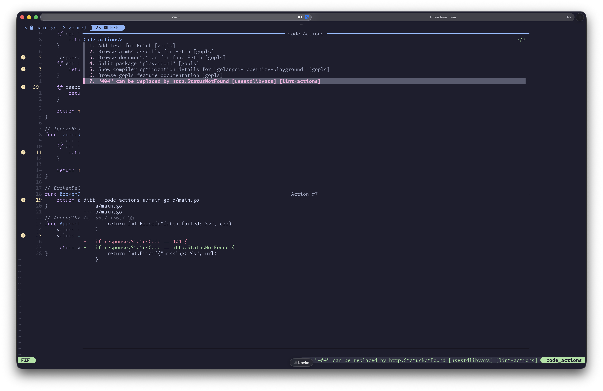

# lint-actions.nvim

Expose structured linter fixes as native Neovim LSP code actions. Actions work with `vim.lsp.buf.code_action()`, fzf-lua, Telescope, and other LSP clients without replacing their UI.



Requires Neovim 0.11 or newer. The core has no dependencies and does not run linters.

```lua
local actions = require('lint_actions')

actions.publish({
  bufnr = bufnr,
  source = 'my-tool',
  items = {
    {
      range = range,
      action = {
        title = 'Apply suggested fix',
        kind = 'quickfix',
        edit = workspace_edit,
      },
    },
  },
})
```

For golangci-lint output already produced by nvim-lint:

```lua
require('lint_actions.integrations.nvim_lint').attach({
  linter = require('lint').linters.golangcilint,
  adapter = require('lint_actions.adapters.golangci'),
})
```

See [the architecture note](docs/architecture.md) for the data flow and stale-edit guarantees.

Development setup and commands are in [CONTRIBUTING.md](CONTRIBUTING.md).
